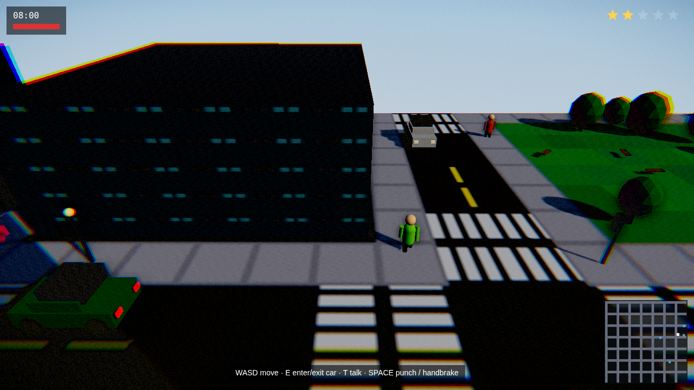
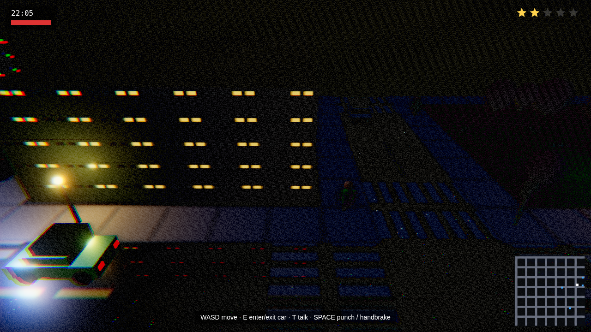

# Molt City — open-world prototype with intelligent NPCs

A GTA-style sandbox that runs entirely in the browser, rendered in real-time
3D with Three.js/WebGL through a cinematic post-processing pipeline. The point
of the prototype is the **NPC intelligence**: citizens aren't decorative —
they see, remember, talk, and the city reacts to what you do.

**Graphics pipeline** (`src/render3d.js`): physically-based rendering →
SSAO (ambient occlusion) → HDR UnrealBloom → cinematic grade (vignette,
film grain, edge chromatic aberration, contrast/saturation) → ACES filmic
tone-mapping. On top of that:

- PBR car paint with clearcoat and environment-map reflections
- a real day/night cycle: a moving sun with dynamic shadows, a gradient sky
  dome with a sun disc, drifting procedural clouds, a moon, stars that fade
  in at night, and warm dawn/dusk tinting
- **true planar reflections** on wet asphalt at night (the streets mirror
  the lit skyline); roads are dry during the day, which also skips the
  reflection pass for performance
- dynamic night lighting: pooled streetlight, headlight, and police-siren
  lights that follow the player, plus emissive neon shop signage and
  window glow
- street furniture: cycling traffic lights at intersections, crosswalks,
  fire hydrants, benches, and trash cans
- articulated pedestrians with a swinging arm/leg walk cycle
- atmospheric rain after dark
- a smoothed GTA-style chase camera that leads in the direction of travel

Low-end devices or headless capture can append `?quality=fast` (drops SSAO
and reflections) and `?pixelRatio=1` to the URL.




## Run it

```bash
npm install
npm run game        # serves the game with Vite — open the printed URL
npm run game:smoke  # headless simulation test (no browser needed)
```

## Controls

| Key | On foot | In a car |
|-----|---------|----------|
| `WASD` / arrows | walk | drive / steer |
| `E` | steal the nearest car | get out |
| `T` | talk to the nearest pedestrian | — |
| `Space` | punch | handbrake |
| `1` `2` `3` | pick a dialogue option | — |
| `Esc` | leave conversation | — |

## What makes the NPCs intelligent

Every pedestrian runs the same pipeline each frame
(`game/src/npc.js`):

1. **Personality** — four traits rolled at spawn (`bravery`, `lawfulness`,
   `sociability`, `curiosity`) weight every decision they make. A brave,
   curious NPC films your crimes on their phone; a cowardly lawful one runs
   first and dials 911 once they feel safe.

2. **Daily schedule** — the game clock (1 real second = 1 game minute) drives
   a routine: commute to work at 08:00, errands and strolls during the day,
   the park after 17:00, home and indoors at night. Movement uses A* over the
   tile map with sidewalk-preferring costs, so people cross roads reluctantly
   and never clip through buildings.

3. **Perception → memory** — crimes (car theft, assault, hit-and-runs) are
   broadcast as world events. NPCs in range *witness* them and store a memory
   (what, where, when, who). Fear rises based on proximity, severity, and how
   brave they are.

4. **Gossip** — calm, sociable NPCs stop and chat when they pass each other,
   and they exchange their juiciest recent memory. Secondhand knowledge is
   marked `heard`: a witness will accuse you to your face, while someone who
   only heard the rumor just warns you the neighborhood's gone downhill.
   Steal a car in front of one person and the whole block knows by lunch.

5. **Utility decision-making** — every ~0.4s each NPC scores its options
   (keep commuting, flee, hide-and-watch, call the police, confront the
   perpetrator, chat) against its personality, fear level, and distance to
   the threat, then commits to the winner. Calling 911 takes a few vulnerable
   seconds standing still — and is what actually raises your wanted level.

6. **Police** — cops only know your *last seen* position. They chase on
   sight, search the last sighting otherwise, and your wanted level cools off
   only after you stay out of their line of sight. Patrol proximity makes
   crimes near cops instantly hotter.

7. **Grounded dialogue** (`game/src/dialogue.js`) — talk to anyone with `T`.
   Lines are assembled from their actual mental state: witnessed memories vs.
   rumors, current fear, personality, and time of day. Ask for directions and
   they compute the real compass bearing and block distance to the nearest
   shop on the map.

## Wiring dialogue to Claude (optional)

The dialogue system is deliberately split so generative dialogue is a
drop-in upgrade: `npcContext(npc, world)` in `game/src/dialogue.js` already
serializes everything an LLM needs (name, personality, mood, current state,
memories tagged witnessed-vs-heard, time of day).

Since this repo is a Cloudflare Worker with an `ANTHROPIC_API_KEY` binding,
the natural shape is a small Worker route that the game calls:

```
POST /api/npc-chat  { context: npcContext(npc, world), playerLine: "..." }
  → worker calls the Anthropic Messages API with a system prompt like
    "You are {name}, a citizen. Stay in character. Here is what you know
     and how you feel: {context}. Reply in one short line."
  → { reply: "..." }
```

Keep the local template system as the fallback so the game stays playable
offline.

## Code map

| File | What it owns |
|------|--------------|
| `src/world.js` | procedural city grid, buildings/parks, road flow field, A* |
| `src/entities.js` | player, car physics, ambient traffic AI |
| `src/npc.js` | the NPC brain: schedule, perception, memory, gossip, utility AI |
| `src/police.js` | wanted heat, cop pursuit/search behavior, arrests |
| `src/dialogue.js` | memory-grounded conversation + LLM-ready context export |
| `src/render3d.js` | Three.js scene: city geometry, lighting, day/night, chase camera |
| `src/main.js` | world setup, input, simulation step, HUD overlay |
| `smoke.mjs` | headless end-to-end test of the whole AI pipeline |
